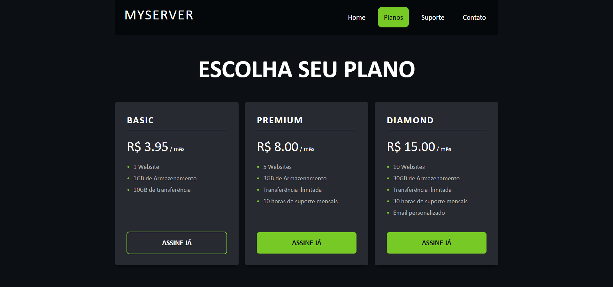

# 💻 Hosting Pricing Page

Este projeto consiste em uma **página de planos de hospedagem**, desenvolvida com o objetivo de praticar conceitos de **HTML e CSS**, focando na criação de layouts modernos e organização de componentes visuais.

## 🎯 Objetivo

O principal objetivo foi simular uma página real de apresentação de planos (pricing), muito comum em sites de empresas de tecnologia, trabalhando organização visual e estruturação de conteúdo.

## 🛠 Tecnologias utilizadas

- HTML5
- CSS3
- Responsividade com Media Queries

## 📌 Funcionalidades

- Exibição de planos de hospedagem (Basic, Premium e Diamond)
- Estrutura de layout organizada em colunas
- Botões de ação (Call to Action)
- Interface visual moderna e limpa
- Layout responsivo para mobile e desktop

## 📱 Responsividade

| Desktop | Mobile |
|---|---|
|  |  |

## 🚀 Aprendizados

Durante o desenvolvimento deste projeto, foram praticados:

- Estruturação semântica com HTML
- Criação de layouts com CSS
- Organização de elementos em cards
- Estilização de botões e componentes
- Alinhamento e espaçamento entre elementos
- Responsividade com media queries
- Adaptação de layout para diferentes tamanhos de tela

## 🔗 Acesse o projeto

Repositório:
https://github.com/devbymatheus/hosting-pricing-page

## 📚 Sobre

Este projeto faz parte da minha jornada de aprendizado em desenvolvimento web, com foco na construção de interfaces e evolução prática no front-end.

